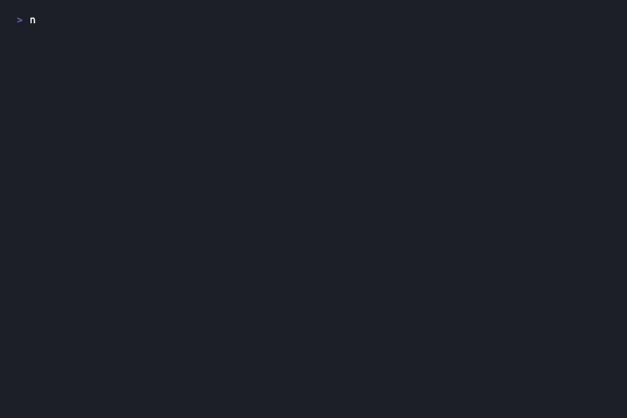

[](https://github.com/edgeless-ai/pinescript-mcp/actions)
[](LICENSE)
[](https://www.npmjs.com/package/pinescript-mcp)
[](https://nodejs.org)

# pinescript-mcp

MCP server for Pine Script development. Gives your AI assistant the ability to lint, migrate, and scaffold Pine Script -- no TradingView Desktop required.

<p align="center">
  
</p>

## What problems does this solve?

**Your v4 scripts are breaking.** TradingView is pushing everyone to v5/v6. Functions got renamed, parameters got removed, namespaces changed. `pine_migrate` rewrites your code automatically -- v4 to v5, v5 to v6, or v4 to v6 in one shot -- and tells you exactly what changed.

**Your backtest returns 400% but live trading loses money.** Repainting bugs leak future data into historical bars. `pine_repainting_check` catches `security()` with lookahead, `timenow`, unguarded `barstate`, and `varip` -- the patterns that make backtests lie.

**You're writing Pine Script from memory.** Was it `sma()` or `ta.sma()`? Does `strategy.entry()` take `qty` or `size`? `pine_reference` and `pine_namespace` give your AI instant access to every built-in function signature without leaving the conversation.

**You keep copy-pasting from forums.** `pine_template` ships 7 battle-tested starting points -- indicators, strategies, libraries, and alert setups -- so you start from working code instead of Stack Overflow fragments.

## Examples

See real workflows in action:

- [Migrating a legacy v4 codebase to v6](docs/examples/migrate-legacy-codebase.md) -- audit, migrate, verify
- [Catching repainting bugs before they cost you money](docs/examples/catch-repainting-bugs.md) -- why your backtest lies
- [Building a strategy from scratch](docs/examples/build-strategy-from-scratch.md) -- templates + reference lookup
- [Automated code review for Pine Script](docs/examples/code-review-pine-script.md) -- structural audit + lint + repainting check

## Install

```bash
npm install pinescript-mcp
```

### Claude Code

```bash
claude mcp add pinescript -- npx pinescript-mcp
```

### Claude Desktop

Add to `claude_desktop_config.json`:

```json
{
  "mcpServers": {
    "pinescript": {
      "command": "npx",
      "args": ["pinescript-mcp"]
    }
  }
}
```

### Any MCP client

```bash
npx pinescript-mcp
```

Communicates over stdio using the Model Context Protocol.

## Tools

| Tool | What it does |
|------|-------------|
| `pine_lint` | 16 rules across errors, warnings, and info. Catches v4/v5/v6 breaking changes, repainting, bad practices. |
| `pine_migrate` | Rewrite code between v4, v5, and v6 with a full change log. Handles 40+ function renames. |
| `pine_repainting_check` | Focused analysis for data integrity -- lookahead leaks, timenow, barstate, varip, calc_on_every_tick. |
| `pine_validate` | Parse and report structure -- version, declaration, variables, functions, inputs, plots, requests. |
| `pine_template` | 7 starter templates: indicators, strategies, libraries, alerts. |
| `pine_reference` | Look up any built-in function, variable, or constant by name. |
| `pine_namespace` | Browse Pine Script namespaces: ta, math, str, request, strategy. |
| `pine_migration_guide` | Get the complete breaking changes list for any version pair. |

## Lint rules

### Errors

| Rule | Catches |
|------|---------|
| E001 | Missing `//@version=N` annotation |
| E002 | Missing `indicator()` / `strategy()` / `library()` declaration |
| E003 | `=` vs `:=` reassignment confusion |
| E004 | v4 functions used in v5+ (`sma()` should be `ta.sma()`) |
| E005 | `security()` without `request.` prefix in v5+ |
| E006 | v6 breaking changes (`transp` removal, `when` parameter removal) |
| E007 | Plot functions called inside user-defined functions |

### Warnings

| Rule | Catches |
|------|---------|
| W001 | `request.security()` with `lookahead_on` but no `[1]` offset (repainting) |
| W002 | `timenow` usage (always repaints) |
| W003 | `barstate.isrealtime` without `barstate.isconfirmed` guard |
| W004 | `varip` -- not reproducible on historical bars |
| W005 | More than 40 `request.*()` calls |
| W006 | More than 64 plot calls |
| W007 | `calc_on_every_tick=true` in strategy |

### Info

| Rule | Catches |
|------|---------|
| I001 | Missing `title` on plot functions |
| I002 | Strategy with entries but no exits or risk management |

## Migration

Supports v4 to v5, v5 to v6, and v4 to v6 (chained).

**v4 to v5** renames 40+ functions:
- `study()` to `indicator()`
- `sma()` to `ta.sma()`, `ema()` to `ta.ema()`, `rsi()` to `ta.rsi()`, ...
- `security()` to `request.security()`
- `abs()` to `math.abs()`, `ceil()` to `math.ceil()`, ...
- `tostring()` to `str.tostring()`
- `iff(cond, a, b)` to ternary `cond ? a : b`
- `resolution=` to `timeframe=`

**v5 to v6** handles breaking changes:
- `transp` parameter removal (flags with TODO comment)
- `when` parameter removal from strategy functions
- `timeframe.period` comparison updates

## Templates

| Template | Description |
|----------|-------------|
| `indicator-basic` | Simple overlay indicator |
| `indicator-oscillator` | Oscillator with overbought/oversold levels |
| `strategy-basic` | Moving average crossover strategy |
| `strategy-rsi-mean-reversion` | RSI mean reversion with risk management |
| `strategy-breakout` | Donchian channel breakout |
| `library-basic` | Reusable library scaffold |
| `alert-setup` | Alert condition patterns |

## Development

```bash
git clone https://github.com/edgeless-ai/pinescript-mcp.git
cd pinescript-mcp
npm install
npm test
```

53 tests across parser, linter, and migrator modules.

## License

MIT
